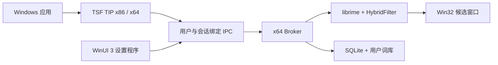

# 五笔·拼音

[](https://github.com/yimingwu425/WubiPinyin/actions/workflows/ci.yml)
[](https://github.com/yimingwu425/WubiPinyin/releases/latest)
[](LICENSE.txt)
[](#系统要求)

面向 Windows 11 的本地五笔、拼音自动输入法。它在同一个输入框、同一次 composition 中同时运行 86 五笔和全拼解码，统一排序、去重并展示候选词。

> 当前版本：[`0.17.4.1`](https://github.com/yimingwu425/WubiPinyin/releases/tag/0.17.4.1)
>
> [下载 Windows 安装包](https://github.com/yimingwu425/WubiPinyin/releases/download/0.17.4.1/wubipinyin-0.17.4.1-installer.exe)

## 功能

- 86 五笔与全拼在同一 composition 中自动竞争，无需预先切换输入法。
- 五笔、拼音候选统一排序；同文候选去重并保留来源信息。
- 支持自动、仅五笔、仅拼音三种临时路由。
- 支持候选翻页、数字键选词、鼠标选词和每页 `5-9` 个候选。
- 使用 Rime 本地学习选词频率，支持关闭和重置学习数据。
- 提供本地用户词库，可管理文字、方案、编码、权重和启用状态。
- 提供独立 WinUI 3 设置程序，包含输入、外观、用户词库、学习与隐私、关于五个页面。
- 设置、学习和用户词库均保存在本机，不上传按键或词库数据。

## 系统要求

- Windows 11 x64。
- 安装包同时包含 x86 和 x64 TIP，兼容 32 位和 64 位桌面应用。
- Broker、Deployer 和设置程序为 x64。

当前 MVP 不支持 Windows 10、ARM64、游戏和安全桌面，也不包含双拼、模糊音、繁体、云同步或自动更新。

自动模式是同一 composition 的五笔、拼音双路候选竞争，不是任意字符级自由混输 lattice。例如一次输入会由两路共同给出候选，但不会在一个未提交编码串中任意交替解析每个字符所属方案。

## 安装

1. 从 [Releases](https://github.com/yimingwu425/WubiPinyin/releases/latest) 下载 `wubipinyin-0.17.4.1-installer.exe`。
2. 运行安装程序并完成 Windows 的权限确认。
3. 从任务栏输入法选择器中选择“五笔·拼音”。
4. 从开始菜单打开“五笔·拼音设置”管理输入方式、外观和用户词库。

当前个人发行包未进行代码签名。若 Windows 显示未知发布者，请先确认下载地址来自本仓库，并核对 Release 页面提供的 SHA-256 摘要。

卸载时默认保留设置和词库；只有在卸载确认中明确选择后才会删除用户数据。

## 输入操作

| 操作 | 按键 |
| --- | --- |
| 选择首选候选 | `Space` |
| 选择指定候选 | 数字键或鼠标 |
| 提交原始字母串 | `Enter` |
| 取消当前输入 | `Esc` |
| 临时切换自动模式 | `Ctrl+Shift+A` |
| 临时锁定五笔 | `Ctrl+Shift+W` |
| 临时锁定拼音 | `Ctrl+Shift+P` |

输入法不会因为唯一四码五笔候选而自动上屏，避免截断更长的拼音输入。

## 设置程序

| 页面 | 功能 |
| --- | --- |
| 输入 | 默认路由、全拼规则说明、候选页大小 |
| 外观 | 跟随系统、浅色或深色主题，候选来源标记 |
| 用户词库 | 搜索、新建、修改、删除、启用或停用词条 |
| 学习与隐私 | 学习开关、重置学习、密码输入保护 |
| 关于 | 版本、开源归属和数据位置 |

设置程序采用 WinUI 3/C++/WinRT，但不会把 Windows App SDK 加载进 TIP DLL 所在的宿主进程。

## 数据与隐私

用户数据位于：

```text
%AppData%\WubiPinyin
```

- Rime/LevelDB 负责明确选词后的本地词频学习。
- SQLite 负责设置和手工用户词库，不记录每次按键。
- 密码输入保护开启时，TIP 在输入范围确认前不会把按键发送给 Broker。
- 取消 composition 或使用 `Enter` 提交原始字母串时不会学习候选。

## 架构



- `WeaselTSF`：TSF 生命周期、按键接入和输入上下文。
- `WeaselIPC` / `WeaselIPCServer`：有限帧长、版本化协议和超时控制。
- `WeaselServer`：Broker、Rime 会话、设置同步和用户词典维护。
- `WubiPinyinCore`：C++20 设置、SQLite、协议和词库逻辑。
- `WubiPinyinSettings`：独立 WinUI 3 设置程序。
- `WubiPinyinData`：混合 schema、用户词典模板和锁定的词库来源。

## 从源码构建

构建环境：

- Visual Studio 2022，安装“使用 C++ 的桌面开发”。
- Windows SDK 和 Windows App SDK 构建工具。
- CMake、Git、Bash 和 NSIS。
- 可访问 NuGet 和项目锁定的上游源码。

在 Visual Studio 2022 x64 Developer Command Prompt 中：

```bat
copy env.vs2022.bat env.bat
install_boost.bat
build.bat release installer verify-hybrid-filter
```

安装包输出到：

```text
output\archives\wubipinyin-*-installer.exe
```

Windows CI 会构建 WinUI 设置程序、x86/x64 librime 与 TIP、运行 HybridFilter 注册测试，并生成 NSIS 安装包。当前发布构建记录见 [GitHub Actions](https://github.com/yimingwu425/WubiPinyin/actions).

## 项目来源与许可证

本项目基于 [rime/weasel](https://github.com/rime/weasel) 和 [librime](https://github.com/rime/librime) 开发，按照 GPLv3 派生路线发布。项目自身修改见 [LICENSE.txt](LICENSE.txt)。

五笔码表、拼音词库及其他依赖的锁定版本和归属说明见：

- [WubiPinyinData/THIRD_PARTY_NOTICES.md](WubiPinyinData/THIRD_PARTY_NOTICES.md)
- [WubiPinyinData/sources.lock.json](WubiPinyinData/sources.lock.json)

感谢 Rime、Weasel 及相关开源词库和依赖项目的维护者与贡献者。

## 反馈

- [提交问题](https://github.com/yimingwu425/WubiPinyin/issues)
- [提交 Pull Request](https://github.com/yimingwu425/WubiPinyin/pulls)
